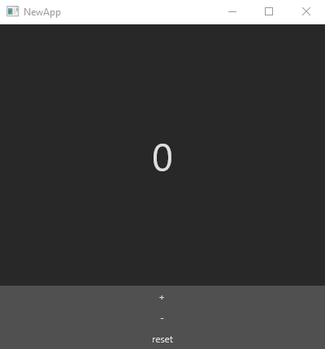
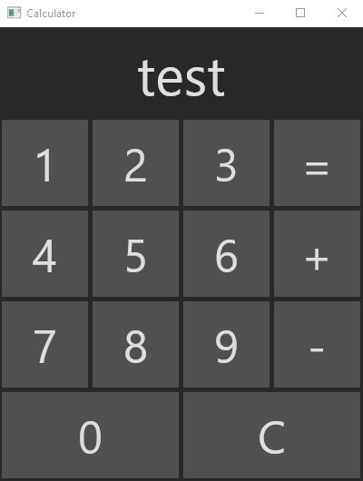

[Blog Hub](../index) | [Previous](post9)

# Post 10 A Functioning Functional GUI

## Why Not Haskell?

 

We've worked a lot with Haskell and we even have a cool project with Roman Numerals built in it, so why aren't we going to use Haskell for making a visual program? Because usability and support for UI packages in Haskell is **_seriously_** lacking. It was difficult enough to get any of the packages running, but as a Windows user, I wasn't happy with the feasability of any of the environments I set up for the purposes of this blog. Luckily, F# has well supported and brain-dead easy to set up UI packages! So, we're going to be using [Avalonia FuncUI](https://github.com/AvaloniaCommunity/Avalonia.FuncUI/) for this little tour of _Functioning Functional GUIs_.

---

## Setting Up Avalonia

 

Like I said, setting this up is very simple, just make sure you have [Visual Studio](https://visualstudio.microsoft.com/downloads/) or [Visual Studio Code](https://code.visualstudio.com/download) installed on your computer before hand.

To get started and download some template projects, simply run the following command in your terminal or power shell:

    dotnet new --install JaggerJo.Avalonia.FuncUI.Templates

After that finishes up, you can then make a new project from a template by running one of the following commands:

    dotnet new funcui.basic -n NewApp

 

    dotnet new funcui.full -n NewApp

 

    dotnet new funcui.quickstart -n NewApp

Of course, just change the name "NewApp" to whatever you would like to name the app. To open it in vscode, simply cd into the new directory made called NewApp (or whatever you named the project) then enter the command `code .` to open up a new isntance of vscode with the project ready to go.

    > dotnet new funcui.basic -n NewApp

    > cd ./NewApp
      -- OR --
    > cd .\NewApp

    > code .

Then to run the app simply enter the following command while inside the project directory.

    dotnet run

A new window should pop up that looks something like this:

---

## A Quick Look Around

 

Take a second to look through the code. The `Program.fs` file is the entry point into the project, but we needn't worry about what's going on there for now, with maybe the exception of the lines 

    base.Title <- "NewApp"
    base.Width <- 400.0
    base.Height <- 400.0

The function of which should be pretty obvious, but go ahead and modify those just to make sure you know what they do.

The real meat and potatoes of Avalonia comes in Counter.fs as that's where the code to draw and update the application live.

You should notice a few things

1. This is part of a namespace called NewApp. Program.fs is part of that as well
1. Everything that draws the app is contained within a single module. If you want to have multiple "scenes" to your app, they would be in different modules, but I won't get into that in this blog.
1. There are a couple custom types present in the module. 
    * `State` holds on to the state of the program. It is a special kind of data type similar to a python dictionary called a Record Type. We talked about record syntax all the way back in [post 3](post3)
    * `Msg` is NOT monododium gutamate, but it is just as tasty. It is an abstract data type that keeps track of different messages that buttons and interactable objects can send.
1. The update function takes messages and updates the state of the application.
1. The view function is where you build the layout of the application. As you can see, there's a tree structure to it with different components like panels, buttons, text boxes, etc.

[Here's the documentation website](https://avaloniacommunity.github.io/Avalonia.FuncUI.Docs/guides/Home.html) (it's another GitHub pages site!)

---

## A Simple Project

 

Just for fun, let's make a simple calculator that just adds two numbers. Make a new project if you like, or simply modify the existing one.

The first thing you should change is the base title from NewApp to Calculator (if you didn't make a new project)

    base.Title <- "NewApp"
    base.Width <- 400.0
    base.Height <- 400.0

    -- TO --

    base.Title <- "Calculator"
    base.Width <- 400.0
    base.Height <- 400.0

Then, change the name of Counter.fs to Calculator.fs

In Calculator.fs and Program.fs, change the namespace from NewApp to Calculator.

In Calculator.fs, change the name of the module from Counter to Calculator.

On line 22 of Program.fs, change Counter.init, etc to Calculator.init, etc.

Finally, in the project file, Calculator.fsproj, make sure in the `<ItemGroup>` section that it Calculator.fs is included instead of Counter.fs

Go ahead and run your program to ensure that everything is working.

---

## The Data Types

 

When making a calculator, we need to keep track of a few things in our `State` type:
1. The display string,
2. The first number,
3. The second number, and
4. The operation

In code: 

    type State = { Num1 : string 
                   Num2 : string
                   Oper : ???
                   Disp : string}

The numbers are strings so typing in values is easier to manage. What kind of variable should we include for the operation? A new one, of course! **Before** the declaration of the `State` add the following code:

    type Operation = 
        | Unknown
        | Add
        | Subtract

You can have more than just those two if you like, but I'm keeping it simple. Anyway, just replace the question marks with `Operation`

We need an intitial state, so let's set one

    let init = { Num1 = "0"
                 Num2 = "0"
                 Oper = Unknown
                 Disp = "0" }

Now let's make our messages, one for each button:

    type Msg = 
        | Zero
        | One
        | Two
        | Three
        | Four
        | Five
        | Six 
        | Seven 
        | Eight 
        | Nine 
        | Reset 
        | Add 
        | Subtract
        | Evaluate

We'll talk about the update function in a bit, but for now, let's just add some temporay code:

    let update (msg: Msg) (state: State) : State =
        match msg with
        | Zero -> init
        | One -> init
        | Two -> init
        | Three -> init
        | Four -> init
        | Five -> init
        | Six -> init
        | Seven -> init
        | Eight -> init
        | Nine -> init
        | Reset -> init
        | Add -> init
        | Subtract -> init
        | Evaluate -> init

---

## Formatting

 

Now comes the fun part: Formatting the UI! You'll need a text box for the display and 14 buttons. (One for each number, then add, subtract, reset, and evaluate) Go ahead and try it for yourself, then come back to see my code. Or just copy mine from the start, it really doesn't matter!

Here's the docmnentation for both the F# package and the base Avalonia so you can see what you have access to in terms of formatting options.

* [Avalonia](https://avaloniaui.net/docs/layout/alignment-margins-padding)
* [Avalonia Funcui](https://avaloniacommunity.github.io/Avalonia.FuncUI.Docs/guides/Home.html)

And here's my code:

    let view (state: State) (dispatch) =
        DockPanel.create [
            DockPanel.children [
                DockPanel.create [
                    DockPanel.dock Dock.Top
                    DockPanel.height 100.0
                    DockPanel.children [
                        TextBlock.create [
                            TextBlock.fontSize 60.0
                            TextBlock.verticalAlignment VerticalAlignment.Center
                            TextBlock.horizontalAlignment HorizontalAlignment.Center    
                            TextBlock.text (string state.Disp)
                        ]
                    ]
                ]
                DockPanel.create [
                    DockPanel.dock Dock.Bottom
                    DockPanel.height 400.0
                    DockPanel.children [
                        DockPanel.create [
                            DockPanel.dock Dock.Top
                            DockPanel.horizontalAlignment HorizontalAlignment.Center
                            DockPanel.height 100.0
                            DockPanel.children [
                                Button.create [
                                    Button.onClick (fun _ -> dispatch One)
                                    Button.content "1"
                                    Button.fontSize 50.0
                                    Button.width 95.0
                                    Button.height 95.0
                                    Button.margin (2.5, 2.5)
                                    Button.verticalAlignment VerticalAlignment.Center
                                    Button.horizontalAlignment HorizontalAlignment.Center  
                                ]
                                Button.create [
                                    Button.onClick (fun _ -> dispatch Two)
                                    Button.content "2"
                                    Button.fontSize 50.0
                                    Button.width 95.0
                                    Button.height 95.0
                                    Button.margin (2.5, 2.5)
                                    Button.verticalAlignment VerticalAlignment.Center
                                    Button.horizontalAlignment HorizontalAlignment.Center 
                                ]
                                Button.create [
                                    Button.onClick (fun _ -> dispatch Three)
                                    Button.content "3"
                                    Button.fontSize 50.0
                                    Button.width 95.0
                                    Button.height 95.0
                                    Button.margin (2.5, 2.5)
                                    Button.verticalAlignment VerticalAlignment.Center
                                    Button.horizontalAlignment HorizontalAlignment.Center 
                                ]
                                Button.create [
                                    Button.onClick (fun _ -> dispatch Evaluate)
                                    Button.content "="
                                    Button.fontSize 50.0
                                    Button.width 95.0
                                    Button.height 95.0
                                    Button.margin (2.5, 2.5)
                                    Button.verticalAlignment VerticalAlignment.Center
                                    Button.horizontalAlignment HorizontalAlignment.Center 
                                ]
                            ]
                        ]
                        DockPanel.create [
                            DockPanel.dock Dock.Top
                            DockPanel.horizontalAlignment HorizontalAlignment.Center
                            DockPanel.height 100.0
                            DockPanel.children [
                                Button.create [
                                    Button.onClick (fun _ -> dispatch Four)
                                    Button.content "4"
                                    Button.fontSize 50.0
                                    Button.width 95.0
                                    Button.height 95.0
                                    Button.margin (2.5, 2.5)
                                    Button.verticalAlignment VerticalAlignment.Center
                                    Button.horizontalAlignment HorizontalAlignment.Center  
                                ]
                                Button.create [
                                    Button.onClick (fun _ -> dispatch Five)
                                    Button.content "5"
                                    Button.fontSize 50.0
                                    Button.width 95.0
                                    Button.height 95.0
                                    Button.margin (2.5, 2.5)
                                    Button.verticalAlignment VerticalAlignment.Center
                                    Button.horizontalAlignment HorizontalAlignment.Center 
                                ]
                                Button.create [
                                    Button.onClick (fun _ -> dispatch Six)
                                    Button.content "6"
                                    Button.fontSize 50.0
                                    Button.width 95.0
                                    Button.height 95.0
                                    Button.margin (2.5, 2.5)
                                    Button.verticalAlignment VerticalAlignment.Center
                                    Button.horizontalAlignment HorizontalAlignment.Center 
                                ]
                                Button.create [
                                    Button.onClick (fun _ -> dispatch Add)
                                    Button.content "+"
                                    Button.fontSize 50.0
                                    Button.width 95.0
                                    Button.height 95.0
                                    Button.margin (2.5, 2.5)
                                    Button.verticalAlignment VerticalAlignment.Center
                                    Button.horizontalAlignment HorizontalAlignment.Center 
                                ]
                            ]
                        ]
                        DockPanel.create [
                            DockPanel.dock Dock.Top
                            DockPanel.horizontalAlignment HorizontalAlignment.Center
                            DockPanel.height 100.0
                            DockPanel.children [
                                Button.create [
                                    Button.onClick (fun _ -> dispatch Seven)
                                    Button.content "7"
                                    Button.fontSize 50.0
                                    Button.width 95.0
                                    Button.height 95.0
                                    Button.margin (2.5, 2.5)
                                    Button.verticalAlignment VerticalAlignment.Center
                                    Button.horizontalAlignment HorizontalAlignment.Center  
                                ]
                                Button.create [
                                    Button.onClick (fun _ -> dispatch Eight)
                                    Button.content "8"
                                    Button.fontSize 50.0
                                    Button.width 95.0
                                    Button.height 95.0
                                    Button.margin (2.5, 2.5)
                                    Button.verticalAlignment VerticalAlignment.Center
                                    Button.horizontalAlignment HorizontalAlignment.Center 
                                ]
                                Button.create [
                                    Button.onClick (fun _ -> dispatch Nine)
                                    Button.content "9"
                                    Button.fontSize 50.0
                                    Button.width 95.0
                                    Button.height 95.0
                                    Button.margin (2.5, 2.5)
                                    Button.verticalAlignment VerticalAlignment.Center
                                    Button.horizontalAlignment HorizontalAlignment.Center 
                                ]
                                Button.create [
                                    Button.onClick (fun _ -> dispatch Subtract)
                                    Button.content "-"
                                    Button.fontSize 50.0
                                    Button.width 95.0
                                    Button.height 95.0
                                    Button.margin (2.5, 2.5)
                                    Button.verticalAlignment VerticalAlignment.Center
                                    Button.horizontalAlignment HorizontalAlignment.Center 
                                ]
                            ]
                        ]
                        DockPanel.create [
                            DockPanel.dock Dock.Top
                            DockPanel.horizontalAlignment HorizontalAlignment.Center
                            DockPanel.height 100.0
                            DockPanel.children [
                                Button.create [
                                    Button.onClick (fun _ -> dispatch Zero)
                                    Button.content "0"
                                    Button.fontSize 50.0
                                    Button.width 195.0
                                    Button.height 95.0
                                    Button.margin (2.5, 2.5)
                                    Button.verticalAlignment VerticalAlignment.Center
                                    Button.horizontalAlignment HorizontalAlignment.Center  
                                ]
                                Button.create [
                                    Button.onClick (fun _ -> dispatch Reset)
                                    Button.content "C"
                                    Button.fontSize 50.0
                                    Button.width 195.0
                                    Button.height 95.0
                                    Button.margin (2.5, 2.5)
                                    Button.verticalAlignment VerticalAlignment.Center
                                    Button.horizontalAlignment HorizontalAlignment.Center 
                                ]
                            ]
                        ]
                    ]
                ]
            ]
        ]

A bit hefty for sure, but logical. There's a master panel, then two smaller ones: a panel for the display and one for the buttons. Then, there are four sub-panels in the button panel, one for each row, and finally each of the buttons are in the sub-panels. I also added some fancy formatting with borders and the like, but that's not necessary. Just make something you're happy with. Mine looks like this:

---

## Functionality

 

Now that we have a gorgeous UI, let's fill in the blanks on that `update` function!

First things first, let's make the number buttons update the dispaly accordingly. Since we're only working with integers, the only time a number can begin with a zero is if it *is* zero. This lets us simply replace a lone zero if a number is pressed, otherwise we can simply concatenate the new number to whatever is already on the display. Make sure to set the initial value of `init` to zero as well!

    match msg with
    | Zero -> { state with Disp = if state.Disp = "0" then "0" else state.Disp + "0"}
    | One -> { state with Disp = if state.Disp = "0" then "1" else state.Disp + "1"}
    | Two -> { state with Disp = if state.Disp = "0" then "2" else state.Disp + "2"}
    | Three -> { state with Disp = if state.Disp = "0" then "3" else state.Disp + "3"}
    | Four -> { state with Disp = if state.Disp = "0" then "4" else state.Disp + "4"}
    | Five -> { state with Disp = if state.Disp = "0" then "5" else state.Disp + "5"}
    | Six -> { state with Disp = if state.Disp = "0" then "6" else state.Disp + "6"}
    | Seven -> { state with Disp = if state.Disp = "0" then "7" else state.Disp + "7"}
    | Eight -> { state with Disp = if state.Disp = "0" then "8" else state.Disp + "8"}
    | Nine -> { state with Disp = if state.Disp = "0" then "9" else state.Disp + "9"}

Reset already does what it's supposed to, so we don't have to worry about that line.

Pressing either of the two operation numbers should do a few things:
1. Set the operation.
2. Ensure both nums are set correctly.
3. Potentially evaluate if the user is entering a sequence of numbers.

[Reference](https://github.com/AvaloniaCommunity/Avalonia.FuncUI/)

[Blog Hub](../index) | [Previous](post9)
